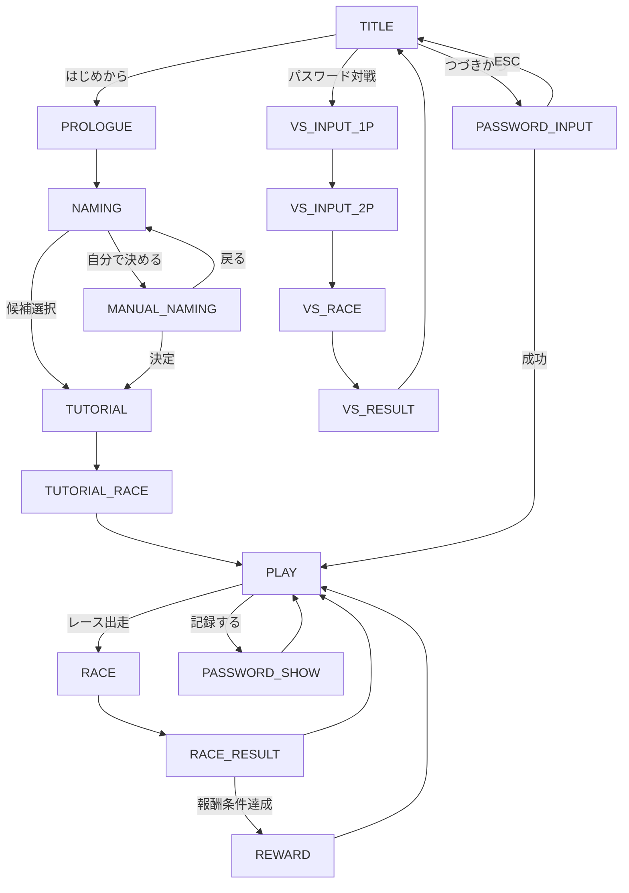

# どぅなん・ダッシュ！ — 仕様書・要件定義
**最終更新**: 2026-03-22 (Phase 10: 日本語入力ウィンドウ)

---

## 1. プロジェクト概要

| 項目 | 内容 |
|------|------|
| **タイトル** | DUNAN DASH!（どぅなん・ダッシュ！） |
| **ジャンル** | 競馬育成シミュレーション（ダビスタ風） |
| **エンジン** | Pyxel (Python 8-bit game engine) |
| **解像度** | 256 × 224 px |
| **FPS** | 30 |
| **フォント** | 美咲ゴシック BDF（8×8 日本語フォント） |
| **データ保存** | パスワード方式（JSON → zlib → Base64） |
| **テーマ** | 沖縄県・与那国島の与那国馬 |

---

## 2. ファイル構成

```
4792hose/
├── main.py              # エントリーポイント、App クラス、全画面状態遷移
├── ui.py                # 描画関数群、ウィンドウ、50音キーボード
├── game.py              # GameState: 全サブシステム統合
├── horse.py             # Horse クラス: 能力値、外見、繁殖
├── ranch.py             # Ranch クラス: 馬管理、パドック、資金
├── calendar_system.py   # Calendar: 月週進行、レーススケジュール
├── race.py              # RaceEngine, RaceHorse: レースシミュレーション
├── save_load.py         # パスワード生成・読込
├── audio.py             # 8bit BGM / SE 定義
├── download_font.py     # 美咲ゴシック自動DLスクリプト
├── assets/
│   └── misaki_gothic.bdf
└── requirements.txt     # pyxel
```

---

## 3. 画面状態遷移（STATE）

| # | STATE名 | 概要 |
|---|---------|------|
| 0 | `TITLE` | タイトル画面（はじめから / つづきから / パスワード対戦） |
| 1 | `PROLOGUE` | おじぃの導入セリフ（6画面） |
| 2 | `NAMING` | 馬の名前選択（7候補 + 自分で決める） |
| 3 | `TUTORIAL` | 基本操作チュートリアル（開墾→給餌→休養） |
| 4 | `PLAY` | メインループ（DS3風メニュー操作） |
| 5 | `RACE` | レース進行中（オートレース） |
| 6 | `RACE_RESULT` | レース結果表示 |
| 7 | `TUTORIAL_RACE` | レース指南セリフ |
| 8 | `PASSWORD_INPUT` | パスワード入力（つづきから） |
| 9 | `PASSWORD_SHOW` | パスワード表示（記録する） |
| 10 | `REWARD` | クリア報酬（特産品コード） |
| 11 | `VS_INPUT_1P` | VS対戦 1Pパスワード入力 |
| 12 | `VS_INPUT_2P` | VS対戦 2Pパスワード入力 |
| 13 | `VS_RACE` | VS対戦レース進行 |
| 14 | `VS_RESULT` | VS対戦結果 |
| 15 | `MANUAL_NAMING` | ソフトウェアキーボードによる名前入力 |



---

## 4. データモデル

### 4.1 Horse（馬）

| パラメータ | 型 | 範囲 | 説明 |
|------------|------|------|------|
| `name` | str | — | 馬名 |
| `age` | int | 2〜 | 年齢（2歳スタート） |
| `gender` | str | 牡馬/牝馬 | 性別 |
| `speed` | int | 0-255 | スピード |
| `stamina` | int | 0-255 | スタミナ |
| `guts` | int | 0-255 | 根性 |
| `wisdom` | int | 0-255 | 賢さ |
| `luck` | int | 0-255 | 運 |
| `temper` | int | 0-255 | 気性（高い=荒い） |
| `weight` | int | 150-300 | 体重(kg) |
| `best_weight` | int | — | ベスト体重(kg) |
| `fatigue` | int | 0-100 | 疲労度 |
| `prize_money` | int | 0〜 | 累計賞金(G) |
| `contribution` | int | 0〜 | 貢献度 |
| `appearance` | dict | — | 外見（下表参照） |
| `target_race` | str/None | — | 目標レース名 |
| `target_weeks_left` | int | — | 目標までの残り週数 |

#### 外見パラメータ（`appearance`）

| キー | 値 | 意味 |
|------|------|------|
| `base_color` | 4,9,5,13,1 | 鹿毛, 栗毛, 黒, 芦毛, 青毛 |
| `face_marking` | 0-3 | 無し, 星, 流星, 鼻白 |
| `mane_tail_color` | 0,4,10,7 | 黒, 茶, 金, 白 |
| `leg_marking` | 0-2 | 無し, ソックス, ストッキング |

### 4.2 Ranch（牧場）

| パラメータ | デフォルト | 説明 |
|------------|-----------|------|
| `horses` | [] | アクティブな馬（最大2、拡張で3） |
| `paddock` | [] | エターナル・パドック（最大3、加齢停止） |
| `stallions` | [] | 種牡馬（最大8） |
| `broodmares` | [] | 繁殖牝馬（最大8） |
| `balance` | 5000G | 所持金 |
| `reward_code` | "" | クリア報酬コード |

### 4.3 Calendar（暦）

- **構造**: 年 × 12ヶ月 × 4週 = 年48週
- **レーススケジュール**:
  - 1週: 未勝利戦(300G) + ハナハナ賞(500G)
  - 2週: 未勝利戦(300G) + どぅなん特別(1200G)
  - 3週: どぅなん特別(1200G)
  - 4週: サンセット戦(5000G)
  - 特殊: 8月4週「豊年祭カップ(G2)」4000G、12月4週「最西端サンセット記念」10000G

---

## 5. ゲームメカニクス

### 5.1 メインコマンド

| **引退** | 5歳以上で引退→繁殖入り | — |

> ※自動週送り機能はありません。プレイヤーの操作を待機します。

### 5.2 開墾（トレーニング）詳細

| 場所 | 主効果 | 副効果 | 疲労 |
|------|--------|--------|------|
| 比川（穏やか） | 気性-3 | スタミナ+1, 体重-1 | +3 |
| 久部良（ハード） | 根性+3, スタミナ+2 | 体重-3 | +7 |
| 祖納（バランス） | スピード+2, 賢さ+2 | 体重-2 | +5 |

> 深く耕すモードは全効果 ×1.5、疲労 ×1.8

### 5.3 レースシミュレーション

- **距離**: 2000地点
- **参加**: プレイヤー馬 + ライバル4頭（PVE）/ 2頭（VS）
- **速度計算**: `base_speed + スタミナ残量 + 競り合いブースト(根性) + 体重補正 ± ランダム`
- **出遅れ**: 気性>50で確率発生（15-45フレーム遅延）
- **掛かり**: 気性>60でスタミナ無駄消費
- **賞金**: 1着=レース賞金、2-3着=賞金の1/3
- **疲労**: レース後 +30

### 5.4 世代交代

- **引退条件**: 5歳以上
- **引退ボーナス**: 貢献度 × 10G
- **種付け期間**: 1月〜3月のみ
- **遺伝**: 両親平均＋ランダム偏差（突然変異10%）

### 5.5 クリア報酬

- **条件**: 累計貢献度≧10000 **または** サンセット記念で1着
- **報酬**: `YONA-2026-XXXX` 形式のシリアルコード

---

## 6. UI仕様

### 6.1 画面レイアウト（PLAY画面）

```
┌─────────────────────────────────────┐
│           牧場風景 + 馬             │ ← 上部 100px
├──────────────┬──────────────────────┤
│  コマンド    │    情報ウィンドウ    │
│  (左下126px) │    (右上122px)       │
│  ▶開墾      │  1年目 1月 第1週     │
│   給餌      │  所持金 5000G        │
│   休養      │  ハーリー            │
│   レース    │  2才 200kg           │
│   牧場      │  元気いっぱいです    │
│   記録する  │  目標: 登録なし      │
├─────────────┴──────────────────────┤
│           ログウィンドウ           │ ← 下部
│  ようこそ、どぅなん牧場へ！       │
└─────────────────────────────────────┘
 ↑↓:選択 Enter:決定 BS:戻る

> ※「番組表」「種付け」など、項目が長くなるメニューではウィンドウ幅が拡張され、情報ウィンドウの上にオーバーレイ表示されます。
```

### 6.2 ウィンドウスタイル

- 黒背景 + 白枠 + 灰色内枠（SFCダビスタ風）
- タイトルラベル: 黄色文字

### 6.3 ソフトウェアキーボード（名前入力）

- **11列×5行** の文字グリッド + 右サイドバー（6ボタン）
- **モード**: ひらがな / カタカナ / 英数（Tab or サイドバーで切替）
- **サイドバー**: かな → カナ → 英数 → 消す → 決定 → 戻る
- **最大文字数**: 9文字

---

## 7. オーディオ仕様

| ID | 種別 | 用途 |
|----|------|------|
| SE_CURSOR(0) | SE | カーソル移動 |
| SE_CONFIRM(1) | SE | 決定 |
| SE_CANCEL(2) | SE | キャンセル |
| SE_TRAIN(3) | SE | 開墾 |
| SE_HOOF(4) | SE | 蹄の音 |
| BGM_RANCH(0) | BGM | 育成画面（三線風ペンタトニック） |
| BGM_RACE(1) | BGM | レース画面（アップテンポ） |

---

## 8. セーブ/ロード仕様

- **方式**: パスワード文字列（外部ファイル不使用）
- **エンコード**: `JSON → zlib圧縮 → URL-safe Base64`
- **保存対象**: 年月週、所持金、全馬データ、パドック、種牡馬/繁殖牝馬、報酬コード
- **入力方法**: キーボードから英数字入力

---

## 9. 操作体系

| キー | 動作 |
|------|------|
| ↑↓ | メニュー選択 / キーボードカーソル移動 |
| ←→ | 名前選択画面 / キーボードカーソル移動 |
| Enter | 決定 / 文字確定 |
| Backspace | 戻る |
| Escape | キャンセル / 画面戻り |
| Tab | 入力モード切り替え（ひらがな→カタカナ→英数） |

---

## 10. 既知の制約・注意事項

1. パスワードが長い場合、手入力は非現実的（コピペ前提の設計）
2. 馬のパラメータキャップは5歳以降に減衰開始（最低80）
3. 繁殖牝馬/種牡馬は最大各8頭まで（超過分は引退時に破棄）
